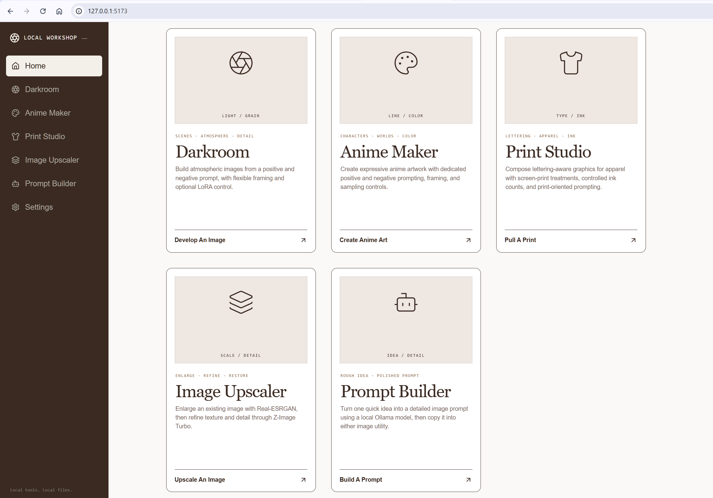
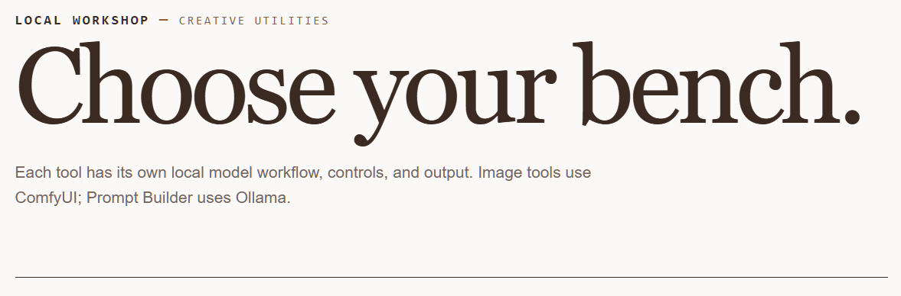
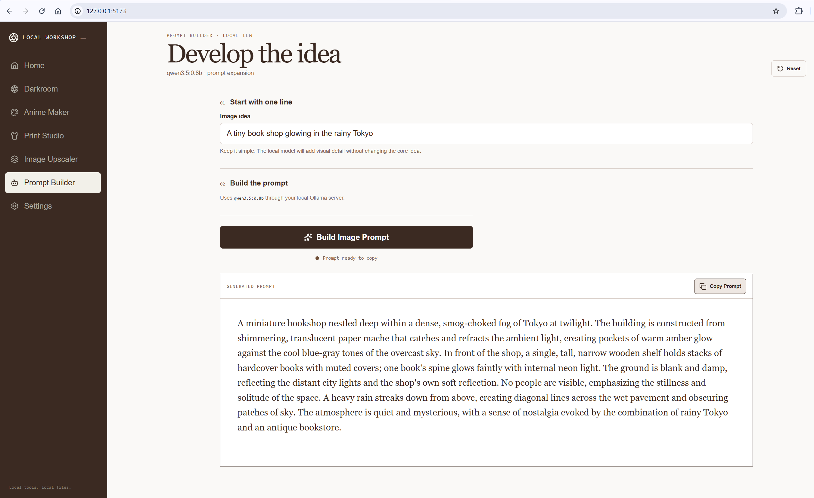

# Local Workshop

Local Workshop is a private, desktop-first creative suite for locally hosted image and prompt models. It connects a browser interface to ComfyUI and Ollama without authentication, a database, or cloud storage.

## Preview

### The Workshop Directory



Five focused utilities share one persistent, configurable navigation rail.

### Homepage Identity



The interface uses a restrained paper-white and coffee palette designed for a wide desktop workspace.

### Local Prompt Builder



Prompt Builder expands a short idea with the configured local Ollama model and provides an explicit clipboard action.

## Utilities

| Utility | Purpose | Local workflow |
|---|---|---|
| Darkroom | General text-to-image work with framing, negative prompting, and optional LoRAs | Z-Image Turbo |
| Print Studio | Lettering-aware artwork intended for T-shirt prints | FLUX.2 Klein 4B Distilled |
| Prompt Builder | Expands a one-line idea into a detailed image prompt with clipboard copying | Ollama and Qwen 3.5 |
| Image Upscaler | Enlarges an existing image and restores/refines detail | Real-ESRGAN 4× and Z-Image Turbo |
| Anime Maker | Anime-focused character and environment generation | Anima Base 1.0 |

The utility rail and homepage cards share a configurable order. Each utility keeps its working state while you move through the app and has an independent Reset action.

## Highlights

- Fully local ComfyUI and Ollama connections
- Responsive white-and-coffee interface designed for desktop use
- Positive and negative prompting where supported
- Preset and custom aspect ratios with portrait, square, and landscape orientation
- Optional Z-Image-compatible LoRA selection
- Model readiness checks and direct model download guidance
- Browser previews and direct PNG downloads
- No application database, user accounts, or backend image archive
- Editable API-format workflow copies in [`workflows`](./workflows)

## Quick Start

1. Install and start ComfyUI at `http://127.0.0.1:8188`.
2. Install and start Ollama at `http://127.0.0.1:11434`.
3. Install the models required by the utilities you plan to use.
4. Copy `.env.example` to `.env` and adjust local endpoints if necessary.
5. Install and start the web app:

```powershell
pnpm install
pnpm dev
```

Open `http://127.0.0.1:5173`.

See [INSTALLATION.md](./INSTALLATION.md) for model locations, configuration, production builds, and troubleshooting.

## Configuration

The Settings page manages only these allow-listed values:

| Variable | Default | Purpose |
|---|---|---|
| `COMFYUI_URL` | `http://127.0.0.1:8188` | Local ComfyUI API |
| `OLLAMA_URL` | `http://127.0.0.1:11434` | Local Ollama API |
| `OLLAMA_MODEL` | `qwen3.5:0.8b` | Prompt Builder model |
| `LLM_SYSTEM_PROMPT` | Built-in default | Prompt expansion instruction |
| `UTILITY_ORDER` | All five utilities | Sidebar and homepage ordering |

`.env` is ignored by Git. The Prompt Builder instruction can be changed and saved from Settings; no separate prompt Markdown file is required. Model filenames and workflow-specific output prefixes are defined inside their utilities rather than global Settings.

## Data Flow

```text
Browser
  ├─ /comfy  → local ComfyUI API
  └─ /ollama → local Ollama API
```

Vite proxies both connections so the browser can use the local services without separate CORS configuration. Source images selected for upscaling are uploaded to ComfyUI's normal input folder. Generated images remain in ComfyUI's output folder; the application retains only browser-session state.

## Workflow Files

- `image_z_image_turbo_darkroom.api.json`
- `flux2_klein_print_studio.api.json`
- `image_upscale_z_image_turbo_workshop.api.json`
- `image_anima_base_workshop.api.json`

These are application-owned copies. The official ComfyUI templates are not modified.

## Development

```powershell
pnpm dev       # development server
pnpm build     # production build in dist/
pnpm preview   # preview the production build
```

The project uses React, Vite, and Lucide icons. UI intent and behavior are documented in [`DESIGN.md`](./DESIGN.md) and [`UX-CONTRACT.md`](./UX-CONTRACT.md).

## Privacy

Local Workshop is designed for loopback services. Do not expose the Vite development server, ComfyUI, or Ollama directly to an untrusted network. Review any third-party model license before commercial use or redistribution.

## License

No project license has been selected yet. Add a `LICENSE` file before publishing if you want others to copy, modify, or redistribute the code.
